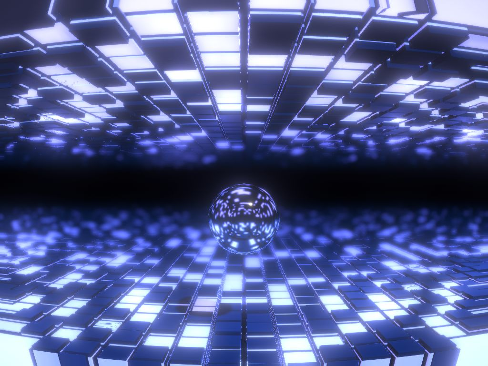

# Unity Demoscene

[デモシーン](https://ja.wikipedia.org/wiki/%E3%83%87%E3%83%A2%E3%82%B7%E3%83%BC%E3%83%B3)界隈では、美しいCGアニメーションをリアルタイムに生成するプログラムを「デモ」と呼びます。

Unityを使ったデモ制作に挑戦したプロジェクトです。

## THE GLOW

「レイマーチングで動的に生成したモデル」と「ポリゴンメッシュのモデル」を混在させた作品です。
ロボットは通常の3Dモデルですが、床や柱のモデルはレイマーチングでプロシージャルに生成しました。

- 動画: [Unity Demoscene Prototype: THE GLOW | YouTube](https://www.youtube.com/watch?v=BZGO5xXuPj8)
- 解説記事: [Unityでメガデモ制作に挑戦（uRaymarchingとTimelineを試す） | gam0022.net](https://gam0022.net/blog/2017/12/25/unity-demoscene/)

## Sandwich

